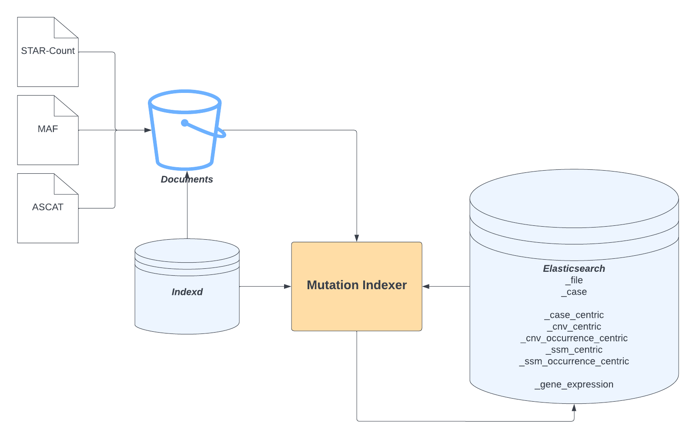

# GDC Mutation Index Export
[](https://travis-ci.com/NCI-GDC/gdc-mutation-indexer)
[](https://github.com/pre-commit/pre-commit)

Backend for exporting mutation indices for visualization on the GDC

- [GDC Mutation Index Export](#gdc-mutation-index-export)
  - [Architecture](#architecture)
  - [Make the docs](#make-the-docs)
  - [Tests](#tests)
  - [Vagrant](#vagrant)
  - [Setup pre-commit hook to check for secrets](#setup-pre-commit-hook-to-check-for-secrets)
  - [Contributing](#contributing)

## Architecture


The mutation indexer combines mutation data from MAF analysis files and metadata
from the data model to create Elasticsearch indices that may be used for
visualization or further analysis.

## Make the docs

```
cd docs
make html
ghp-import build/html
```

## Tests

Tests depend on `$PYTHONPATH` being configured correctly to find the spark 
python modules. Make sure the paths are correct in `bin/run-tests.sh`.

```
bin/run-tests.sh
```

The mutation indexer is currently deployed with Spark 2.4.5.
If you try to run the tests on a different version, you may need to update
`bin/run-tests.sh` to refer to the specific Py4J build included with your
Spark distribution.


## Tests the easy way

After PySpark(current version 2.4.5) is installed via pip, download 
`elasticsearch-hadoop-7.6.2.zip` and extract the content. Copy the file 
`dist/elasticsearch-spark-20_2.11-7.6.2.jar` to 
`venv/lib/python2.7/site-packages/pyspark/jars/`. 

Make sure your elasticsearch server is running at port 9200 and start the tests. If you
see timeout error for es, restart the tests.

## Vagrant

Testing locally can be hard and `vagrant` support has been added to make our lives
a little bit easier. Make sure to have `vagrant` and `VirtualBox` installed, then
simply do and start making coffee, it's gonna take a while:
```
vagrant up
```

This will spin up a VM and run necessary setup steps like:
* installing some core libs like `jdk`, `python-pip` etc
* downloading and setting up `pyspark`, `elasticsearch` and related plugins
* setting up development environment

The tests should be ran from within the box:

```
vagrant ssh
source venv/bin/activate
pytest /vagrant/tests
```

To get a better understanding of how to tweak/customize provisioning steps read
the docs! Have fun testing.

### Use Pycharm debug in Vagrant.

You can use Pycharm debug tool with vagrant, but you need the professional version of 
Pycharm.

1. Set the Vagrant Interpreter

    * In Settings/Preferences > Project <project name> | Python Interpreter. Add new 
        Interpreter, select Vagrant, set 'Python interpreter path' to 
        '/home/vagrant/venv/bin/python', Click 'OK'
       
    * Set Path mappings: <project root> -> '/vagrant'

2. Add new Run/Debug configurations

    * Add new pytest configuration
    * Set script path to <project>/tests (or any test file you want)
    * Select the interpreter you just created, should looks like 'Remote Python 2.7.17
        Vagrant VM ...'
    * Set working directory to your project folder
    * Set the following environment variables
        ```
        SPARK_HOME=/home/vagrant/spark-2.4.5-bin-hadoop2.7
        PYTHONPATH=/home/vagrant/spark-2.4.5-bin-hadoop2.7/python/lib/py4j-0.10.7-src.zip:/home/vagrant/spark-2.4.5-bin-hadoop2.7/python/
        PYSPARK_PYTHON=/home/vagrant/venv/bin/python
        ```

<<<<<<< HEAD
=======
After the above steps, you can save your changes and click the run button to start your 
tests.

## Docker compose

You can also use docker to run the pytest. If you are on a mac, make sure you locate 
about 4G of mem, 4G of swap, and 2 CPUs to docker machine. You can change it in the 
preference of docker desktop software. Then copy your id_rsa file to the project root.
It is required to download and install private python packages from github.
Then run
```
docker-compose up -d
```
and wait for the build to finish.

when it is done, you can run the tests in the docker container:
```
docker exec -it gdc-mutation-indexer_gdc-mutation-indexer_1 /bin/bash
cd /app
pytest tests
```
The test should start. 

### Use Pycharm to debug with Docker Compose

1. Set the Docker Compose Interpreter

    * In Settings/Preferences > Project <project name> | Python Interpreter. Add new 
        Interpreter, select Docker Compose, For services, select gdc-mutation-indexer. 
        Click 'OK'
       
    * Set Path mappings: <project root> -> '/app'

2. Add new Run/Debug configurations

    * Add new pytest configuration
    * Set script path to <project>/tests (or any test file you want)
    * Select the interpreter you just created, should looks like 'Remote Python 2.7.17
        Docker Compose ...'
    * Set working directory to your project folder
    * Set the following environment variables
        ```
        PYTHONPATH=/opt/bitnami/spark/python/lib/py4j-0.10.7-src.zip:/opt/bitnami/spark/python/:$PYTHONPATH
        SPARK_HOME=/opt/bitnami/spark
        PYSPARK_PYTHON=/usr/bin/python2
        ```

3. (optional) You can configure the gdc-mutation-indexer docker to use the 
    elasticsearch on your host. Which should have better performance than the one in
    your docker container.
    
    * Configure elasticsearch to listen on local ips.
        * In the elasticsearch.yml (/usr/local/etc/elasticsearch/elasticsearch.yml), 
            add the following lines:
            ```
            network.bind_host: [_local_, _site_]
            discovery.type: single-node
            ```
        * Restart elasticsearch with `brew services restart elasticsearch`
    * Add the following environment variables in you Run/Debug configurations
    
        ```
        ES_NODES_TEST=host.docker.internal
        ES_HOST_TEST=host.docker.internal
        SOURCE_ES_HOST_TEST=host.docker.internal
        ```

After the above steps, you can save your changes and click the run button to start your 
tests.

### Known Issues

1. The first time you run pytest, the elasticsearch might timeout. If you saw the 
timeout error, run the tests again. The error should disappear.

2. tests/builders/test_gene_expression_builder.py:test_gene_expression_builder will fail.

3. The breakpoint in Pycharm seems not working. 

>>>>>>> DEV-217 add more info on README
## Setup pre-commit hook to check for secrets

We use [pre-commit](https://pre-commit.com/) to setup pre-commit hooks for this repo.
We use [detect-secrets](https://github.com/Yelp/detect-secrets) to search for secrets being committed into the repo. 

To install the pre-commit hook, run
```
pre-commit install
```

To update the .secrets.baseline file run
```
detect-secrets scan --update .secrets.baseline
git add .secrets.baseline
```

`.secrets.baseline` contains all the string that were caught by detect-secrets but are not stored in plain text. Audit the baseline to view the secrets . 

```
detect-secrets audit .secrets.baseline
```


## Contributing

Read how to contribute [here](https://github.com/NCI-GDC/gdcapi/blob/master/CONTRIBUTING.md)
