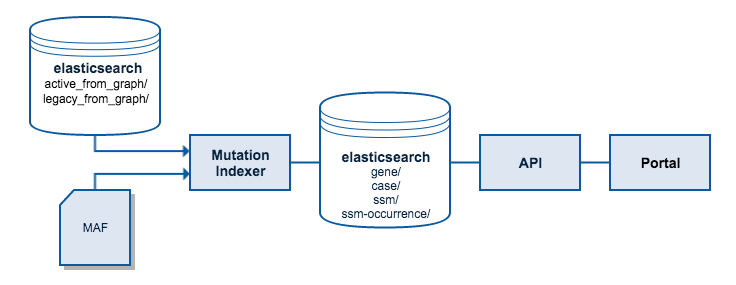

Design and Architecture
=======================

Goal
####

In order to provide visual and exploratory analysis of the GDC's mutation data
concurrently to many users, within sub-second requests, clinical and mutation
data must be combined and de-normalized in a format that will enable quick
retrieval by querying on fields of interest.

To create these documents, the source data is first collected. Masked MAF files
resulting from informatics pipelines are used as the primary source for
mutation data. This data is then combined with case metadata, mostly clinical,
that has been produced by the esbuild process by performining a similar ETL
operation on our datamodel. In addition to these two sources, detailed 
information on the gene level is also added from ICGC's gene model, a collection
of annotatinos from ensembl.

Once joined, this data is structured into a few different de-normalized :ref:`data-views`
that will allow quick access. These four views of the data are then loaded to
Elasticsearch where they will be queryable from the API for use by the portal
or users.

.. _data-views:

Data Views and Indices
######################

Each view of the data also has a corresponding index inside of Elasticsearch
where it is loaded after being constructed.

The structure of each of the indices' documents is as follows.

Case Centric
------------

::

    case{}
    |___ gene[]
          |___ ssm[]
               |___ consequence[]
               |             |_____ transcript{}
               |                          |_____ annotation{}
               |___ observation[]

Gene Centric
------------

::

    gene{}
     |___ case[]
             |___ ssm[]
                   |___ consequence[]
                   |             |_____ transcript{}
                   |                          |_____ annotation{}
                   |___ observation[]

SSM Centric
-----------

::

    ssm{}
    |____ consequence[]
    |           |_____ transcript{}
    |                        |_____ gene{}
    |                        |_____ annotation{}
    |____ occurrence[]
                |_____ case{}
                         |____ observation[]

SSM Occurrence Centric
----------------------

::

    ssm_occurrence{}
    |____ ssm{}
    |        |____ consequence[]
    |                     |_____ transcript{}
    |                                   |_____ gene{}
    |                                   |_____ annotation{}
    |____ case{}
             |____ observation[]

